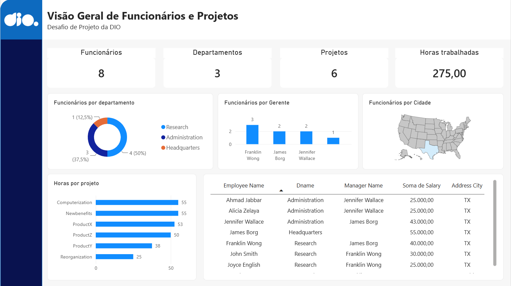

# 📊 Power BI — MySQL & Data Transformation

Projeto desenvolvido como desafio prático da formação **Power BI Analyst da DIO**.

## 🎯 Objetivo

Integrar uma base de dados MySQL ao Power BI, realizando tratamento e transformação dos dados com Power Query e criando um dashboard para análise de funcionários, departamentos e projetos.

## 🛠️ Ferramentas

* MySQL
* MySQL Workbench
* Power BI
* Power Query
* GitHub

## 📊 Dashboard

## 🔄 Transformação dos Dados

Foram realizadas etapas de tratamento e transformação dos dados, incluindo:

* Ajuste de tipos de dados;
* Tratamento de valores nulos;
* Relacionamento entre funcionários e gerentes;
* Integração de funcionários e departamentos;
* Tratamento e divisão dos endereços;
* Associação de departamentos às suas localizações;
* Organização das informações de projetos e horas trabalhadas;
* Remoção de colunas desnecessárias e duplicidades;
* Agrupamento de funcionários por gerente.

Também foi utilizado o recurso **Merge** do Power Query para combinar informações relacionadas entre as tabelas.

## ⚠️ Observação

O desafio propunha a utilização de uma instância **MySQL no Azure**. Como não foi possível criar a instância durante o desenvolvimento, foi utilizada uma instalação local do **MySQL 8.0**, mantendo a estrutura da base e as etapas de integração e transformação propostas no desafio.

## 💡 Aprendizados

Prática na integração entre MySQL e Power BI, utilização do Power Query para tratamento e transformação de dados, criação de relacionamentos e desenvolvimento de indicadores e visualizações para análise das informações.

---

🚀 Projeto desenvolvido para fins de estudo e portfólio.
